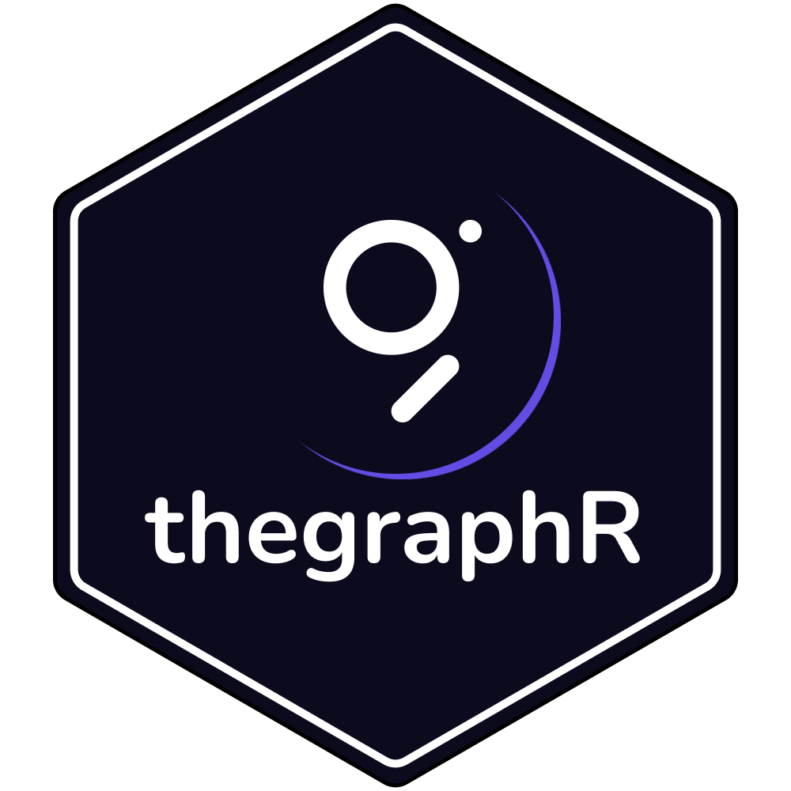

```{r setup, include=FALSE}
knitr::opts_chunk$set(
  collapse = TRUE,
  comment = "#>",
  fig.path = "man/figures/README-"
)
source("~/Documents/git/secrets.R")
```

## thegraphR <br>

<!-- badges: start 
[](https://github.com/tidyverse/ggplot2/actions/workflows/R-CMD-check.yaml)
[](https://app.codecov.io/gh/brandonleekramer/tidyweb3?branch=main)
[](https://cran.r-project.org/package=ggplot2)
badges: end -->

`thegraphR` is a package of wrapper functions to get indexed blockchain data from The Graph Network

**Authors:** [Brandon Kramer](https://www.brandonleekramer.com/) | 
**License:** [MIT](https://opensource.org/licenses/MIT)<br/>

<br>

## Installation

You can install the development version of thegraphR package from [GitHub](https://github.com/) with:

``` r
# install.packages("devtools")
devtools::install_github("brandonleekramer/thegraphR")
```

## Subgraphs

- **Subgraphs:** Subgraphs allow users to query data on smart contracts using GraphQL. For example, to query all transactions within a single Uniswap v3 liquidity pool over the last 24 hours, Uniswap simply needs to define their schema, index the event data to create the subgraph, and then use the generated GraphQL API to query their subgraph for flexible and efficient blockchain data. With [The Graph](https://thegraph.com/), subgraphs can also be published onchain so *anyone* can use them! Several other blockchain data providers, including Alchemy and Goldsky, allow you to create your own subgraphs. We opted to develop wrapper functions for The Graph specifically because that protocol provides the largest open repository of existing subgraphs to query onchain projects.<br>
- **Example:** In this example, we use the [Uniswap V3 subgraph](https://thegraph.com/explorer/subgraphs/5zvR82QoaXYFyDEKLZ9t6v9adgnptxYpKpSbxtgVENFV?v=0&view=Playground&chain=arbitrum-one) on The Graph Network. To search for subgraphs that index other smart contracts, use [Graph Explorer](https://thegraph.com/explorer). The Graph also has a [free hosted service](https://thegraph.com/hosted-service), but it is set to retire in Q2 2024.<br> 
- **Process:** We develop a GraphQL query under the `Playground` tab, copy the `Subgraph ID` from the top of the page, and copy both into our R code. Next, we go to [Subgraph Studio](https://thegraph.com/studio/apikeys/) to get an API key. Note that this subgraph is deployed on The Graph on Arbitrum, which you check by validating the Network Switcher in the top-right corner of the page.<br> 

```{r example}
library("onchainR")

uniswap_query = "{ factories(first: 5) { id poolCount txCount totalVolumeUSD }}"
uniswap_subgraph = "5zvR82QoaXYFyDEKLZ9t6v9adgnptxYpKpSbxtgVENFV"
my_api_key = graph_api_key

query_subgraph(graphql_query = uniswap_query,
               subgraph_id = uniswap_subgraph,
               api_key = my_api_key)
```


